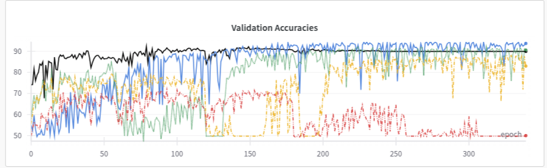

# 19-23 mai 2025: PhD To-Do list

## Tasks
### Current Paper

#### Implementation 
- Construction of the incrementative PHs
- Distance measurements
    - Observation : all heads converge to the same output : 
        Indeed they are solving a convex problem
        - cf : Run Convergence (we plugged successively ten heads to the first block and their cosine similarity all converged to the same layer)
- <del> Destruction and reinit of ~duplicates 
- Test: Plug a two-layers heads to get out of convex problems (Convergence 2layers wandb + PH_accumulations_20mai.py)
    - Observations
        1. Need to change the dimensions for two layers as it take too much space
            - rather than (input, input) and (input, output=2), do (input,512) and (512, 2) 
        2. Layers still converge to become the same, but we end up with less destruction of the rest of the performance and
        3. Their performance don't go up after retraining...
- 3 questions: 
    1. Does this observation 3 hold if we relaunch a head for retraining ?
        - exp 1: relaunch head at the retraining phase (ph lr 0.5)
    3. Does this hold and work without plugging new heads (as anyway, they collapse) ?
        - exp 2: relaunch it without new heads  (ph lr 0.5)
    3. Can we get the same behavior if we successively do it for each block ? 
        - exp 3 (ph lr 0.5): do a script in which 
            - for each block B
                1. we do a full training for block B 
                2. we suppress all the PHs >3
            - Reinit all PHs and train them to completion
        -
Results 21 mai : 
- exp 1 : erreur liée à l'enregistrement des PHs 
- ***exp 2: same behavior with a single head***
- exp 3: erreaur liée à la non-réinitialisation des optimizers et schedulers 
- overall : lr=0.5 (from the cosineAnnealing scheduler period...), redo with lr=0.1

To do: 

4. <del>Setup
    - Assess save the model
    - Assess ability to restart with higher lr
5. Evaluation 2 layers gamma = 0
6. Standard experiment on block 0 + Relaunch head at the end

Results 21 mai: 
- Exp 3 "clean": no freezing of the block but successive minimization. 

    - Observations :
        - PH_i goes up as soon as the lr goes down 
        - PH_i goes way back up after it stops being minimized
            - False for PH0 -> real need to relaunch PHs to really assess what happens  

22 mai : 
- Derniers tests avant de revenir à la version précédente : 
    1. Try not minimizing the MI of the new head straight away : as soon as it reaches a performance > 70%, minimize it
        - result: they still all collapse
    2. Idea: Try minimizing only the MI of the best PH of the previous epoch
        - result: seems to work well until the lr goes down
    3. Test 1: Try without reducing the lr and with infinite epochs (test with lr=0.1 and lr=0.01)
    4. Test 2: (alongside Test 1) Try the same with single layer heads 

26 mai
- Test to remove the skip connections for the PH